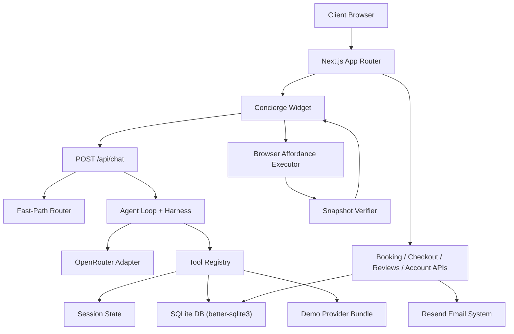

# <div align="center">✨ Clear Skin ✨</div>

<div align="center">
  <p><b>A premium, production-grade AI clinic-commerce and marketing experience built with Next.js 14</b></p>
</div>

<p align="center">
  <a href="https://nextjs.org/">
    
  </a>
  <a href="https://typescriptlang.org/">
    
  </a>
  <a href="https://tailwindcss.com/">
    
  </a>
  <a href="https://sqlite.org/">
    
  </a>
  <a href="https://openrouter.ai/">
    
  </a>
  <a href="https://resend.com/">
    
  </a>
</p>

---

## 📖 Overview

**Clear Skin** is a modern clinic and skincare brand experience that seamlessly blends marketing, commerce, and custom AI tools. Unlike generic chatbots, Clear Skin's AI Concierge is a **typed, site-aware operator** that is fully integrated into the browser's frontend state. It runs a unique two-lane architecture (Fast-Path vs. Bounded LLM Loop) to guide clients, mutate carts, open pages, verify page states, and hand off to a custom booking engine.

---

## 📸 Visual Showcase

<table align="center">
  <tr>
    <td align="center"><b>🤖 AI Concierge Chat (Mobile View)</b></td>
    <td align="center"><b>📋 Clinical Skin Assessment Quiz</b></td>
  </tr>
  <tr>
    <td align="center">
      
    </td>
    <td align="center">
      
    </td>
  </tr>
  <tr>
    <td align="center"><b>🛍️ AI-Powered Upsell Suggestions</b></td>
    <td align="center"><b>📅 Interactive Treatment Booking & Checkout</b></td>
  </tr>
  <tr>
    <td align="center">
      
    </td>
    <td align="center">
      
    </td>
  </tr>
</table>

---

## 🛠️ Key Features

*   🤖 **AI Concierge Chat (`/api/chat`)**: Multi-turn SSE-streaming assistant that knows the site's layout. It uses a custom LLM loop to parse client intent, call system tools, execute browser actions, and verify state modifications.
*   📋 **AI Skin Quiz (`/api/quiz`)**: A smart client assessment flow recommending personalized treatment plans and product routines based on skin concerns, MID-day feel, and routine goals.
*   🛍️ **AI Upsell Rationale (`/api/upsell`)**: Explains clinical mechanisms of actions for product/treatment pairings to build credibility and increase average order value.
*   ✉️ **AI No-Show Recovery (`/api/noshow`)**: Helps admin operators quickly generate context-aware, warm, non-accusatory rebooking emails for clients who missed appointments.
*   📧 **Resend Email capture & Nurture flows**: Auto-dispatched customer verification codes, booking confirmations, and product routine guides via Resend.
*   💾 **Encrypted SQLite Database**: A secure local storage layer for customer records, session states, orders, bookings, reviews, and slots.

---

## 🏗️ System Architecture

Clear Skin runs on a two-lane interaction model: safe, common paths use deterministic fast-routing, while complex queries deploy a bounded LLM agent loop.



---

## ⚙️ Environment Setup

Copy [.env.example](.env.example) to `.env.local` and configure:

```env
# AI Model & OpenRouter Setup
OPENROUTER_API_KEY=your_openrouter_api_key
OPENROUTER_MODEL=openai/gpt-4o-mini
OPENROUTER_TIMEOUT_MS=12000

# Embeddings & Vector Database
OPENAI_API_KEY=your_openai_api_key
OPENAI_EMBEDDING_MODEL=text-embedding-3-small
PINECONE_API_KEY=your_pinecone_api_key
PINECONE_INDEX_HOST=https://your-index.pinecone.io
PINECONE_NAMESPACE=clear-skin-concierge

# Transactional Emails (Resend)
RESEND_API_KEY=your_resend_api_key
SITE_URL=http://localhost:3000
CLEAR_SKIN_FROM_EMAIL=Clear Skin <onboarding@resend.dev>

# Local SQLite Database & Security
CLEAR_SKIN_DB_PATH=./data/clear-skin.sqlite
CLEAR_SKIN_ENCRYPTION_KEY=generate-with-openssl-rand-base64-32
```

---

## 🚀 Getting Started

1. **Install dependencies**:
   ```bash
   npm install
   ```

2. **Run the development server**:
   ```bash
   npm run dev
   ```
   Open [http://localhost:3000](http://localhost:3000) to view the application.

3. **Verify the production build**:
   ```bash
   npm run build
   ```

---

## 🧪 Testing & Verification

Clear Skin has built-in testing layers to verify LLM constraints, vector database retrieval, and checkout safety rules:

*   **Guardrails Smoke Test**:
    ```bash
    npm run test:concierge:guardrails
    ```
    This verifies that cart mutations, bookings, pregnancy prompts, and adverse reaction queries respect system safety guidelines.
*   **Concierge Diagnostics Endpoint**:
    Open `/api/concierge/diagnostics?query=What%20is%20your%20return%20policy%3F` while running locally to debug RAG status, semantic cache, and active LLM configuration safety.

---

## 📁 Key File Map

*   **Presentation Layer**:
    *   [app/page.tsx](app/page.tsx) — Main site marketing landing page.
    *   [components/modules/Concierge.tsx](components/modules/Concierge.tsx) — AI Concierge client widget.
    *   [components/modules/SkinQuiz.tsx](components/modules/SkinQuiz.tsx) — Skin quiz and analysis UI.
    *   [components/modules/BookingEngine.tsx](components/modules/BookingEngine.tsx) — Local clinic scheduler.
*   **API Layer**:
    *   [app/api/chat/route.ts](app/api/chat/route.ts) — AI Concierge conversational endpoint.
    *   [app/api/quiz/route.ts](app/api/quiz/route.ts) — Skin quiz analysis endpoint.
    *   [app/api/upsell/route.ts](app/api/upsell/route.ts) — Add-to-cart clinical recommendation engine.
    *   [app/api/noshow/route.ts](app/api/noshow/route.ts) — Recovery drafts endpoint.
*   **Data & Utils**:
    *   [lib/db.ts](lib/db.ts) — SQLite schemas and client initialization.
    *   [lib/openrouter.ts](lib/openrouter.ts) — OpenRouter API adapter.
    *   [scripts/test-concierge-guardrails.mjs](scripts/test-concierge-guardrails.mjs) — Guardrail regression check.
