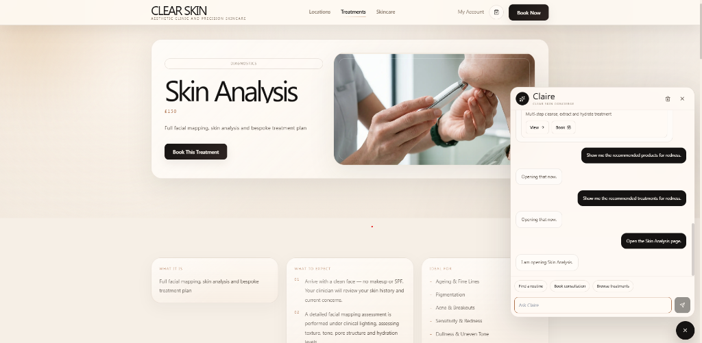
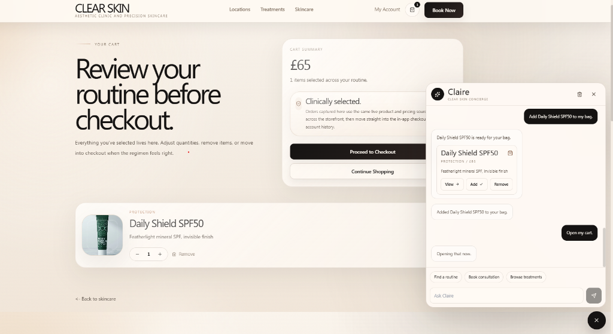
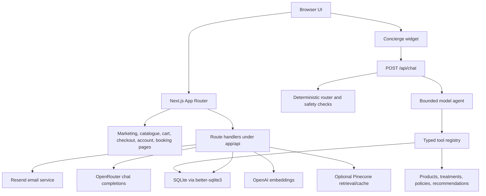
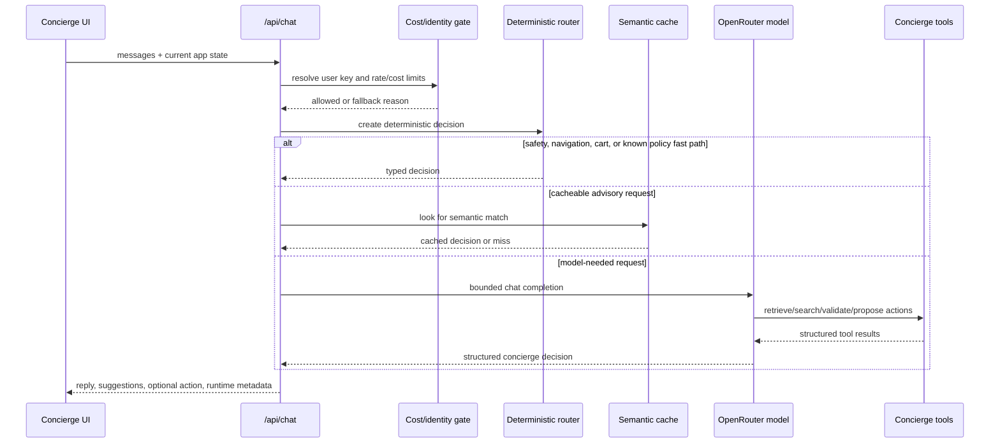

# Clear Skin Concierge Site

Clear Skin is a Next.js clinic-commerce demo for a premium skincare brand. It combines a marketing website, treatment and product catalogue, booking and checkout flows, customer account access, email workflows, and a site-aware AI concierge.

This repository is intended as a documentation and portfolio snapshot of the `lume-site` app. It is not configured for GitHub Pages because the app depends on Next.js server routes, local data storage, and server-side AI/email integrations.

## Table Of Contents

- [What This Project Demonstrates](#what-this-project-demonstrates)
- [Screenshots](#screenshots)
- [Architecture](#architecture)
- [AI Concierge Design](#ai-concierge-design)
- [Routes And Modules](#routes-and-modules)
- [Data And Persistence](#data-and-persistence)
- [Environment Variables](#environment-variables)
- [Local Development](#local-development)
- [Testing And Verification](#testing-and-verification)
- [Deployment Notes](#deployment-notes)
- [Repository Hygiene](#repository-hygiene)
- [Further Documentation](#further-documentation)

## What This Project Demonstrates

Clear Skin is built around a realistic clinic and skincare commerce journey:

- Marketing pages for the brand, treatments, skincare products, accessibility, privacy, and terms.
- Treatment detail pages with category, price, expectation, suitability, and booking paths.
- Skincare product pages with add-to-cart interactions and product recommendation surfaces.
- Cart and checkout flows backed by server routes.
- A booking engine with local schedule availability and booking persistence.
- Account access via email verification code and signed session cookies.
- Review submission and retrieval.
- Email capture and transactional messaging through Resend.
- AI-driven flows for chat, skin quiz analysis, upsell rationale, and no-show recovery copy.
- A diagnostics endpoint for checking concierge configuration, retrieval, and recent cost events.

The main technical idea is the concierge: it is not just a text box over a static site. It returns typed decisions that the frontend can use to navigate, show products, show treatments, open a quiz, propose cart changes, or start a booking handoff.

## Screenshots

<table>
  <tr>
    <td align="center"><strong>Concierge chat on mobile</strong></td>
    <td align="center"><strong>Skin analysis result</strong></td>
  </tr>
  <tr>
    <td></td>
    <td></td>
  </tr>
  <tr>
    <td align="center"><strong>Cart upsell rationale</strong></td>
    <td align="center"><strong>Checkout and booking flow</strong></td>
  </tr>
  <tr>
    <td></td>
    <td></td>
  </tr>
</table>

Additional screenshots live in [public/images/screenshots](public/images/screenshots).

## Architecture

The app uses the Next.js App Router with server route handlers for commerce, account, booking, review, and AI operations.



At a high level:

- `app/` contains pages and route handlers.
- `components/` contains layout, UI primitives, and feature modules.
- `data/` contains static product, team, and treatment catalogues.
- `lib/` contains business logic, persistence, AI adapters, concierge routing, and scheduling.
- `public/` contains imagery, video, and README screenshots.
- `docs/` contains deeper design reviews, QA notes, runbooks, and concierge architecture notes.

## AI Concierge Design

The concierge lives mainly in [components/modules/Concierge.tsx](components/modules/Concierge.tsx), [app/api/chat/route.ts](app/api/chat/route.ts), and [lib/concierge](lib/concierge).

### Request Flow



### Decision Types

The concierge response type is defined in [lib/concierge/types.ts](lib/concierge/types.ts). It includes:

- `mode`: `direct_action`, `advisory_chat`, `guided_workflow`, or `clarification_needed`.
- `reply`: the assistant-facing answer shown in the chat.
- `action`: an optional typed action the frontend can execute or ask the user to confirm.
- `suggestions`: follow-up prompts grouped as question, navigation, cart, booking, or education.
- `safetyNotes`: deterministic notes for sensitive or constrained requests.

Supported actions:

| Action | Purpose | Confirmation |
| --- | --- | --- |
| `navigate` | Move to a known page, product page, treatment page, cart, checkout, or account | Checkout may require confirmation |
| `show_products` | Return real product cards from the catalogue | No |
| `show_treatments` | Return real treatment cards from the catalogue | No |
| `add_to_cart` | Propose adding real products to the cart | Yes |
| `remove_from_cart` | Propose removing real products from the cart | Yes |
| `start_booking` | Start an in-chat booking handoff for a treatment or consultation | Yes |
| `open_quiz` | Open the skin quiz in product or treatment mode | No |

### Safety And Control Layers

The concierge is intentionally layered so common or risky operations do not depend on a free-form LLM response:

- Deterministic fast paths handle direct navigation, cart operations, booking handoffs, known policy questions, current-cart questions, cancellation/decline messages, and safety-sensitive replies.
- Cart mutation and booking actions are confirmation-required.
- The model agent has a bounded tool loop with `MAX_TOOL_TURNS = 2`.
- Model output is parsed and sanitized before it can become a frontend action.
- Product and treatment payloads are rehydrated from local catalogues instead of trusting arbitrary model-provided objects.
- Cost controls track requests, token usage estimates, and daily/request limits.
- Semantic caching can reuse previous advisory decisions when a request is not state-sensitive.
- Retrieval falls back from Pinecone/vector retrieval to lexical matching when credentials are unavailable.

### Tool Registry

[lib/concierge/tools.ts](lib/concierge/tools.ts) exposes the model-facing tools:

| Tool | Responsibility |
| --- | --- |
| `retrieve_business_knowledge` | Retrieve policies, treatment details, product details, FAQs, and recommendation rules |
| `search_products` | Search the real product catalogue |
| `search_treatments` | Search the real treatment catalogue |
| `validate_expert_recommendation` | Check a request against expert rules and safety notes |
| `propose_add_to_cart` | Build a confirmation-required add-to-cart action |
| `propose_remove_from_cart` | Build a confirmation-required remove-from-cart action |
| `propose_booking_handoff` | Build a confirmation-required booking action |
| `propose_navigation` | Build a safe navigation action to a known destination |

## Routes And Modules

### Pages

| Route | Purpose |
| --- | --- |
| `/` | Main brand landing page with hero, treatment/product pathways, and concierge entry points |
| `/about` | Clinic/brand overview |
| `/treatments` | Treatment catalogue |
| `/treatments/[slug]` | Treatment detail pages |
| `/skincare` | Product catalogue |
| `/skincare/[slug]` | Product detail pages |
| `/book` | Booking flow |
| `/cart` | Cart view |
| `/checkout` | Checkout flow |
| `/account` | Account access and customer history |
| `/accessibility`, `/privacy`, `/terms` | Supporting policy pages |

### API Routes

| Route | Purpose |
| --- | --- |
| `POST /api/chat` | Main concierge decision endpoint |
| `GET /api/concierge/diagnostics` | Debug concierge config, retrieval, and recent cost events |
| `POST /api/quiz` | Generate a skin quiz assessment |
| `POST /api/upsell` | Generate product/treatment upsell rationale |
| `POST /api/noshow` | Draft no-show recovery messaging |
| `POST /api/email-capture` | Capture email leads and trigger nurture flows |
| `POST /api/bookings` | Create bookings |
| `GET /api/schedule/availability` | Read schedule availability |
| `POST /api/checkout` | Create demo orders |
| `GET/POST /api/cart` | Cart server interactions |
| `GET/POST /api/reviews` | Review retrieval/submission |
| `POST /api/account/send-code` | Send account login code |
| `POST /api/account/verify-code` | Verify login code and create account session |
| `POST /api/account/logout` | Clear account session |

### Important Components

| File | Role |
| --- | --- |
| [components/layout/Nav.tsx](components/layout/Nav.tsx) | Global navigation and cart/account entry points |
| [components/layout/Footer.tsx](components/layout/Footer.tsx) | Footer and supporting links |
| [components/modules/Concierge.tsx](components/modules/Concierge.tsx) | Client concierge widget and action executor |
| [components/modules/SkinQuiz.tsx](components/modules/SkinQuiz.tsx) | Skin quiz UI and result rendering |
| [components/modules/BookingEngine.tsx](components/modules/BookingEngine.tsx) | Booking UI and schedule slot interaction |
| [components/modules/AccountAccessPanel.tsx](components/modules/AccountAccessPanel.tsx) | Email code login and account access |
| [components/modules/ReviewEngine.tsx](components/modules/ReviewEngine.tsx) | Review submission and display |
| [components/modules/UpsellEngine.tsx](components/modules/UpsellEngine.tsx) | Checkout/product recommendation rationale |
| [components/ui/Button.tsx](components/ui/Button.tsx) | Shared button primitive |
| [components/ui/ProductCard.tsx](components/ui/ProductCard.tsx) | Product display card |
| [components/ui/TreatmentCard.tsx](components/ui/TreatmentCard.tsx) | Treatment display card |

## Data And Persistence

The default data store is SQLite through `better-sqlite3`. The database path defaults to `data/clear-skin.sqlite`, or to `CLEAR_SKIN_DB_PATH` when provided.

[lib/db.ts](lib/db.ts) creates these tables on startup:

| Table | Stores |
| --- | --- |
| `customers` | Customer identity records |
| `account_sessions` | Account login sessions |
| `account_login_codes` | Email verification codes |
| `bookings` | Treatment bookings and booking metadata |
| `schedule_slots` | Location/date/time schedule slot availability |
| `orders` | Checkout orders and serialized items |
| `reviews` | Customer review content |
| `concierge_cost_events` | Concierge request, fallback, cache, and token/cost metadata |

The static catalogues are stored separately:

- [data/products.ts](data/products.ts)
- [data/treatments.ts](data/treatments.ts)
- [data/team.ts](data/team.ts)

Operational note: the SQLite files are ignored by Git. The repository includes schema/bootstrap logic and catalogue source, not local customer/order data.

## Environment Variables

Copy [.env.example](.env.example) to `.env.local`:

```bash
cp .env.example .env.local
```

On Windows PowerShell:

```powershell
Copy-Item .env.example .env.local
```

Core variables:

| Variable | Required | Purpose |
| --- | --- | --- |
| `OPENROUTER_API_KEY` | For model-backed AI | Enables OpenRouter chat completions |
| `OPENROUTER_MODEL` | Recommended | Selects the chat model, defaulting in code to `openai/gpt-4o-mini` |
| `OPENAI_API_KEY` | For embeddings/vector retrieval | Enables embeddings and semantic retrieval |
| `OPENAI_EMBEDDING_MODEL` | Optional | Embedding model, defaulting to `text-embedding-3-small` |
| `PINECONE_API_KEY` | Optional | Enables Pinecone retrieval/cache |
| `PINECONE_INDEX_HOST` | Optional | Pinecone index host |
| `PINECONE_NAMESPACE` | Optional | Business knowledge namespace |
| `PINECONE_CACHE_NAMESPACE` | Optional | Semantic cache namespace |
| `PINECONE_AUTO_SEED` | Optional | Seeds static knowledge when set to `true` |
| `RESEND_API_KEY` | For email flows | Enables transactional email |
| `SITE_URL` | Recommended | Base URL used by email flows |
| `CLEAR_SKIN_FROM_EMAIL` | For email flows | Sender address |
| `CLEAR_SKIN_SUPPORT_EMAIL` | Optional | Support contact address |
| `CLEAR_SKIN_DB_PATH` | Optional | SQLite file path |
| `CLEAR_SKIN_ENCRYPTION_KEY` | Recommended | Secret used for encrypted customer fields |
| `CLEAR_SKIN_SCHEDULING_WEBHOOK_URL` | Optional | External scheduling handoff webhook |
| `CLEAR_SKIN_SCHEDULING_API_KEY` | Optional | Scheduling webhook auth |
| `CALENDLY_SCHEDULING_URL` | Optional | External Calendly handoff URL |
| `CONCIERGE_DIAGNOSTICS_TOKEN` | Production diagnostics | Required to access diagnostics in production |

Public variables:

| Variable | Purpose |
| --- | --- |
| `NEXT_PUBLIC_INSTAGRAM_URL` | Instagram link |
| `NEXT_PUBLIC_TIKTOK_URL` | TikTok link |
| `NEXT_PUBLIC_LINKEDIN_URL` | LinkedIn link |
| `NEXT_PUBLIC_CALENDLY_URL` | Public Calendly URL, if used |

## Local Development

Install dependencies:

```bash
npm install
```

Start the development server:

```bash
npm run dev
```

Open [http://localhost:3000](http://localhost:3000).

Build for production:

```bash
npm run build
```

Start the production build locally:

```bash
npm run start
```

Available scripts:

| Script | Purpose |
| --- | --- |
| `npm run dev` | Start the Next.js dev server |
| `npm run build` | Build, lint, type-check, and prerender where possible |
| `npm run start` | Start the production server after a build |
| `npm run lint` | Run Next.js ESLint |
| `npm run test:concierge:guardrails` | Run concierge guardrail checks against a local server |

## Testing And Verification

Suggested verification sequence:

```bash
npm run lint
npm run build
```

The guardrail test expects the app to be running at `http://127.0.0.1:3000`:

```bash
npm run start
npm run test:concierge:guardrails
```

Important notes:

- In production, `/api/concierge/diagnostics` returns `404` unless `CONCIERGE_DIAGNOSTICS_TOKEN` is configured and supplied by query string or `x-concierge-debug-token`.
- The guardrail script checks diagnostics, retrieval readiness, recommendation safety, cart mutation confirmation, and booking safety.
- If AI provider keys are absent, deterministic and lexical fallbacks still let much of the app run locally, but model-backed flows will be limited.

## Deployment Notes

This project is not a static GitHub Pages site. It requires a Node-compatible Next.js runtime because it includes:

- Route handlers under `app/api`.
- Server-side OpenRouter, OpenAI, Pinecone, and Resend calls.
- SQLite access through `better-sqlite3`.
- Cookie-based account/session behavior.

For a real deployment, use a platform that supports the required runtime and storage model. Before production use:

- Set all required environment variables in the hosting provider.
- Replace local SQLite with persistent storage, or ensure the deployment target has durable filesystem support.
- Review whether `better-sqlite3` is compatible with the selected serverless/runtime environment.
- Run `npm audit` and upgrade vulnerable packages before exposing the app publicly.
- Configure `CONCIERGE_DIAGNOSTICS_TOKEN` and avoid exposing diagnostics publicly.
- Rotate any local keys that were ever used during development.
- Confirm transactional email sender domains in Resend.
- Decide whether Pinecone should be seeded automatically or through an explicit operational script.

## Repository Hygiene

The repository is configured to keep local-only data out of Git:

- `.env` and `.env*.local`
- `.next/`, `out/`, and build artifacts
- `node_modules/`
- SQLite files under `data/`
- local logs and temporary scripts
- TypeScript build info

The committed `.env.example` uses placeholders only. Do not commit real API keys, local databases, customer records, or production logs.

## Further Documentation

The `docs/` folder contains deeper implementation notes:

- [docs/clear-skin-concierge-system-design-review.md](docs/clear-skin-concierge-system-design-review.md)
- [docs/concierge-operator-blueprint.md](docs/concierge-operator-blueprint.md)
- [docs/concierge-production-runbook.md](docs/concierge-production-runbook.md)
- [docs/concierge-qa-report.md](docs/concierge-qa-report.md)
- [docs/concierge-query-evaluation-2026-06-12.md](docs/concierge-query-evaluation-2026-06-12.md)

## License And Usage

No open-source license is currently included. Treat this repository as source-available project documentation unless a license is added.
