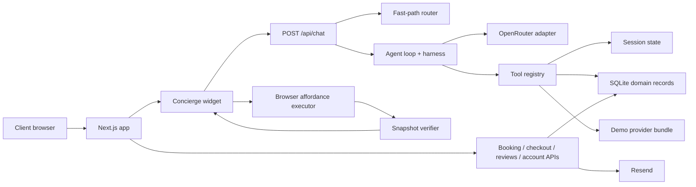

# Clear Skin Concierge AI Agent System Design and Architecture

## 1. Executive summary

Clear Skin is a Next.js 14 clinic-commerce application with an embedded AI concierge that can both answer clinical commerce questions and take bounded actions on the site. The system is not a generic autonomous browser agent. It is a typed, site-aware operator built around known affordances such as navigating to a product page, opening a quiz, adding a product to cart, starting booking, and handing off to checkout.

At runtime, the concierge uses a two-lane architecture:

- a deterministic fast path for safe, known intents and guided workflows
- a bounded LLM loop for multi-step reasoning, tool use, and compound requests

The current implementation is best described as a production-grade demo architecture with real UI state, real browser handoffs, real SQLite-backed clinic/account records, and mocked or demo-scoped provider integrations where live systems do not yet exist.

## 2. Product scope

The application combines five product surfaces:

1. Marketing and brand site
2. Clinic treatment discovery
3. Skincare commerce flow
4. AI concierge and AI quiz experiences
5. Account, booking, review, and retention flows

Core user journeys:

- ask skincare or treatment questions
- get a routine or treatment recommendation
- open product or treatment detail pages
- add products to cart
- start booking with treatment and location context
- move into checkout
- submit booking and order records
- sign in by email code to review history

The repo explicitly includes additional AI endpoints beyond the main concierge:

- AI skin quiz
- AI upsell rationale
- AI no-show recovery drafting
- email capture and nurture dispatch

## 3. Technology stack

Frontend and app platform:

- Next.js 14 App Router
- React 18
- TypeScript
- Tailwind CSS
- Framer Motion

AI and messaging:

- OpenRouter for LLM access
- SSE streaming for live concierge replies
- Resend for transactional emails

Persistence:

- SQLite via `better-sqlite3` for customers, sessions, bookings, orders, reviews, and schedule slots
- cookies for browser cart and account session continuity
- in-memory session state for active agent turns and workflow state
- in-memory demo provider memory for agent recall

Verification and QA:

- TypeScript test harness
- deterministic concierge tests
- browser test artifacts and scripts
- production build verification

## 4. System context



## 5. High-level architecture

### 5.1 Presentation layer

The presentation layer is a Next.js App Router site with route-based product, treatment, cart, checkout, booking, and account experiences. The homepage and detail pages are conventional React pages, while the concierge is an always-available client component that sits on top of the site and can observe page context.

Key files:

- `app/page.tsx`
- `components/modules/Concierge.tsx`
- `components/modules/SkinQuiz.tsx`
- `components/modules/BookingEngine.tsx`
- `app/account/page.tsx`

### 5.2 Agent interaction layer

The concierge widget is the orchestration boundary between browser state and server intelligence. It does four important jobs:

- keeps chat history and UI activity state
- builds and publishes a typed site snapshot
- executes approved UI actions in the browser
- verifies that requested actions actually changed the live site state

This is what makes the implementation more robust than a pure chat bot. The model does not directly manipulate the DOM. It emits typed tool calls or UI actions that are translated into app-native browser operations.

Key files:

- `components/modules/Concierge.tsx`
- `lib/agent/runtime/site-snapshot.ts`
- `lib/agent/runtime/client-executor.ts`
- `lib/agent/runtime/verifiers.ts`

### 5.3 API orchestration layer

`app/api/chat/route.ts` is the primary runtime entrypoint for the concierge. It:

- normalizes the incoming message list
- resolves or creates an agent session
- restores memory and workflow state
- hydrates cart state from cookies
- attempts the deterministic fast path first
- falls back to the bounded agent loop if needed
- streams assistant tokens back over SSE
- persists session, workflow, snapshot, and trace memory after the turn

This route is the control plane for conversational turns.

### 5.4 Agent control plane

The core concierge agent is implemented as a bounded loop rather than a free-form agent. The control plane consists of:

- `lib/agent/loop.ts`
- `lib/agent/harness.ts`
- `lib/agent/prompt.ts`
- `lib/agent/router.ts`
- `lib/agent/planner/*`
- `lib/agent/affordances/*`
- `lib/agent/tools/*`

Responsibilities are split cleanly:

- planner decides what kind of goal the user has
- fast-path router handles deterministic local flows
- system prompt injects live context and relevant knowledge
- adapter translates internal tool schema into OpenRouter JSON responses
- harness enforces iteration, validation, trace logging, and token envelope
- tool registry executes allowed actions only

### 5.5 Domain and persistence layer

The wider product domain is persisted in SQLite, with encrypted personally identifiable fields for customer, booking, and order records. This domain layer is separate from the agent session layer.

SQLite-backed domain entities:

- customers
- account sessions
- account login codes
- bookings
- schedule slots
- orders
- reviews

Key files:

- `lib/db.ts`
- `lib/account-store.ts`
- `lib/schedule-store.ts`
- `lib/customer-records.ts`
- `lib/encryption.ts`

### 5.6 External provider layer

The provider layer exists to separate real agent behavior from missing downstream systems. In the current codebase, only the demo provider bundle is implemented.

Provider families:

- booking
- cart
- checkout
- memory
- profile
- notifications

Key files:

- `lib/agent/providers/types.ts`
- `lib/agent/providers/index.ts`
- `lib/agent/providers/demo/bundle.ts`

## 6. Core concierge runtime design

### 6.1 Two-lane decision model

The concierge uses a hybrid decision model.

Lane 1: deterministic fast path

- used for direct navigation and direct actions
- used for guided workflows like skincare recommendation and booking guidance
- used when the request is simple, safe, and strongly classifiable

Lane 2: bounded model loop

- used for compound requests
- used for tool-based multi-step responses
- used when a direct deterministic route is not enough

This avoids wasting model calls on simple intents while still supporting richer agent behavior.

### 6.2 Guided workflow model

The deterministic orchestrator supports multiple explicit workflow types:

- `skincare_recommendation`
- `treatment_matching`
- `booking_assistant`
- `cart_assistant`

Each workflow stores:

- `type`
- `step`
- `status`
- `collected`
- `updatedAt`

Workflow state is queued and deduplicated so the system can resume interrupted tasks or mention multiple pending tracks.

Key files:

- `lib/concierge-orchestrator.ts`
- `lib/session/types.ts`
- `lib/session/workflows.ts`

### 6.3 Plan-driven execution

The planner recognizes at least these goal families:

- answer-only
- start checkout
- start booking
- resume task
- compound request

Compound requests are first-class. Examples supported by tests:

- open product + add to cart
- add to cart + checkout
- build routine + checkout
- open treatment + start booking

If a plan is deterministic and safe to auto-execute, the system bypasses the live model turn entirely and executes the plan directly.

### 6.4 Tool and affordance model

The affordance registry is the canonical declaration of what the agent is allowed to do. Each affordance defines:

- ID
- label and description
- scope
- risk
- parameter schema
- preconditions
- verification mode
- recovery policy
- demo mockability
- tags

Affordances currently implemented:

- `search_products`
- `view_cart`
- `add_to_cart`
- `remove_from_cart`
- `curate_routine`
- `get_recommendations`
- `navigate`
- `open_quiz`
- `open_product`
- `open_treatment`
- `select_treatment`
- `start_booking`
- `checkout`

The tool definitions exposed to the model are generated from the affordance registry, which is a strong architectural choice because it reduces schema drift between prompting and execution.

### 6.5 Trust and risk policy

The system already reflects a trust model aligned with the operator blueprint:

- `silent` for safe read or navigation actions
- `notify` for reversible mutations like cart updates
- `confirm` for higher-risk handoffs like booking and checkout

This is enforced primarily by the affordance metadata and by UI confirmation behavior in the concierge widget.

### 6.6 Browser execution and verification

Server-side tools do not directly manipulate the browser. Instead they return typed `uiAction` payloads. The client then maps those actions to typed affordance requests and executes them with app-native hooks such as route changes and opening the quiz.

After execution, the browser verifier checks whether the new site snapshot matches the requested postcondition. This is one of the most important architectural strengths in the system because success is tied to observed UI state, not just function return values.

## 7. End-to-end turn sequence

```mermaid
sequenceDiagram
  participant User
  participant Widget as Concierge Widget
  participant API as /api/chat
  participant Router as Fast Path Router
  participant Loop as Agent Loop
  participant LLM as OpenRouter
  participant Tools as Tool Registry
  participant Browser as Browser Executor
  participant Verify as Snapshot Verifier

  User->>Widget: Enter prompt
  Widget->>Widget: Build current site snapshot
  Widget->>API: POST messages + uiMode + sessionId + snapshot
  API->>Router: Try deterministic route
  alt Fast path matches
    Router-->>API: decision + optional uiAction
    API-->>Widget: JSON response
  else Needs agent loop
    API->>Loop: runAgentTurn(...)
    Loop->>LLM: system prompt + messages + tools
    LLM-->>Loop: JSON reply + tool calls
    Loop->>Tools: execute validated tool calls
    Tools-->>Loop: results + optional uiActions
    Loop-->>API: final response + trace
    API-->>Widget: SSE token stream + done payload
  end
  Widget->>Browser: execute uiAction if present
  Browser->>Verify: compare new snapshot to requested affordance
  Verify-->>Widget: passed / failed
  Widget-->>User: show reply, activity, workflow, tool trace
```

## 8. Data architecture

### 8.1 Agent session state

Agent session state is currently in memory and stores:

- cart
- conversation history
- active workflow
- workflow queue
- last snapshot
- token usage
- turn count

This layer is fast and simple, but it is not durable across process restarts or horizontal scaling.

### 8.2 Browser continuity state

Browser continuity uses cookies for:

- cart mirror
- agent session ID
- account session token
- booking and order history compatibility keys

The cart is effectively mirrored between cookie state and agent session state.

### 8.3 Business system records

Business records are persisted in SQLite and include:

- authenticated customer profiles
- login challenges
- booking requests
- schedule slot allocation
- completed checkout orders
- submitted reviews

This means the clinic and commerce surfaces are materially more real than the agent session layer.

### 8.4 PII handling

The application encrypts several sensitive fields before storing them in SQLite, including:

- customer full name
- phone
- guest booking details
- certain booking notes
- order names and address fields

However, the current encryption implementation falls back to a default dev key if no environment key is provided, which is acceptable for local testing but not for production review sign-off.

## 9. API surface

Primary concierge API:

- `POST /api/chat`

AI support APIs:

- `POST /api/quiz`
- `POST /api/upsell`
- `POST /api/noshow`

Clinic-commerce APIs:

- `POST /api/bookings`
- `POST /api/checkout`
- `GET/POST /api/reviews`
- `GET /api/schedule/availability`

Account APIs:

- `POST /api/account/send-code`
- `POST /api/account/verify-code`
- `POST /api/account/logout`

Email capture:

- `POST /api/email-capture`

## 10. Knowledge architecture

The knowledge layer is currently a static in-memory module that contains:

- brand identity
- voice rules
- treatments
- products
- recommendation logic
- delivery policy
- returns policy
- clinic policies
- FAQs

For the main concierge prompt, the system performs targeted section selection rather than injecting the entire knowledge base. The module is explicitly structured as RAG-ready, with clear comments indicating that vector retrieval can later replace the static section exports without changing route contracts.

This is a good transition architecture: simple today, extensible later.

## 11. Booking and checkout design

### 11.1 Booking

Booking is implemented as a realistic local workflow:

- schedule slots are seeded in SQLite
- availability can be queried by location and date
- a booking request reserves a slot in requested state
- a clinic sync step can optionally forward the record to an external webhook
- the request is also stored in the user account

This is stronger than a pure mock because it exercises real domain persistence and slot contention behavior.

### 11.2 Checkout

Checkout is a demo commerce implementation:

- cart is read from cookies
- customer is upserted
- order record is written to SQLite
- a mock payment profile generates payment metadata
- order is shown in account history

It is a valid demo checkout architecture, but not yet a live payments integration.

## 12. Observability, traceability, and QA

### 12.1 Trace model

Every agent turn can produce a trace containing:

- plan metadata
- step starts and results
- verification results
- recovery events
- general informational events

The concierge UI exposes parts of this trace through message metadata, activity items, and traceback panels.

### 12.2 Current verification status

Validation run on this codebase during this review:

- `npm run test:concierge` passed
- `npm run build` passed

Observed build note:

- one React hooks lint warning in `components/modules/Concierge.tsx`

The deterministic test suite covers:

- fast-path actions
- guided workflows
- compound requests
- resume behavior
- cart and checkout planning
- booking handoff planning
- prompt knowledge injection
- site snapshot construction

There are also browser test scripts and existing browser test artifacts in `tests/artifacts/concierge-browser`.

## 13. Architectural strengths

1. The agent is constrained by typed affordances, not vague prompts alone.
2. The system cleanly separates deterministic routing from model-driven reasoning.
3. Browser execution is verified against typed site snapshots.
4. Tool schemas are generated from a canonical affordance registry.
5. The planner supports compound requests, not just single-step intents.
6. The domain layer for bookings, orders, and reviews is materially real.
7. The knowledge layer is already structured for future RAG migration.
8. The codebase includes meaningful deterministic QA coverage for the concierge.

## 14. Review flags and current limitations

These are the main issues a code or product review should explicitly note.

### 14.1 Agent session persistence is not production-grade

`lib/session/store.ts` uses an in-memory `Map`. Active sessions, workflows, and chat continuity are lost on server restart and cannot scale safely across multiple instances.

Impact:

- no durable conversation continuity
- no horizontal scaling for agent state
- limited operational reliability

### 14.2 Demo memory is not durable

The provider memory bundle in `lib/agent/providers/demo/bundle.ts` is also in memory. Session recall and trace memory are therefore process-local.

### 14.3 Checkout and booking providers are demo-mode abstractions

The provider boundary is good, but only the demo provider bundle is implemented. Live integrations for checkout, CRM, notifications, and provider-backed memory are not yet present.

### 14.4 Encryption has an unsafe default for production

`lib/encryption.ts` falls back to a built-in development key if `CLEAR_SKIN_ENCRYPTION_KEY` is absent.

Impact:

- acceptable for local testing
- not acceptable for production or formal security review

### 14.5 Browser affordance coverage is incomplete

`remove_from_cart` exists in the affordance registry, but the browser executor currently returns `NOT_IMPLEMENTED` for browser-side removal.

Impact:

- declared capability is broader than executable browser runtime
- verification coverage is incomplete for full cart mutation parity

### 14.6 Shared demo provider cart state is process-global

The demo provider bundle stores `demoCartState` as a module-level variable. If that provider path is used across sessions, it can leak state between users. The main agent cart is session-scoped, but the provider bundle itself is not.

### 14.7 Logic duplication exists in fallback experiences

The client-side quiz contains fallback recommendation logic separate from the main recommendation and knowledge systems. This improves resilience, but it introduces drift risk between:

- client fallback logic
- deterministic routine mapping
- knowledge-based LLM recommendations

### 14.8 Some product modules are still demo strategy surfaces

Parts of the product, especially certain review and commercial strategy modules, are still intentionally presented as demos rather than live integrated systems. That is fine for concept validation, but reviewers should understand which modules are production-backed and which are illustrative.

## 15. Recommended next steps

### 15.1 For engineering hardening

1. Replace in-memory agent session store with Redis or database-backed session persistence.
2. Add a live provider bundle for memory, checkout, notifications, and CRM/profile integration.
3. Remove the encryption fallback key in non-development environments.
4. Complete browser executor parity for all declared affordances.
5. Add durable trace storage for support, replay, and eval reporting.

### 15.2 For product hardening

1. Make the demo/live boundary explicit in admin or ops documentation.
2. Unify recommendation logic so quiz fallback, routine curation, and recommendation copy derive from one canonical mapping layer.
3. Add analytics around confirmation friction, failed verifications, and workflow abandonment.
4. Expand resume behavior from memory hints into persistent cross-device task continuity.

### 15.3 For review readiness

1. Present this as a bounded operator architecture, not a generic autonomous agent.
2. Emphasize that booking, orders, and account history already persist in SQLite.
3. Be transparent that session memory and external provider integrations are still demo-grade.
4. Include the passing deterministic test and production build results alongside the architecture review.

## 16. Submission-ready position

For a code and product review, the most accurate description is:

Clear Skin Concierge is a typed, site-aware hybrid AI operator embedded in a Next.js clinic-commerce platform. It combines deterministic workflow routing, bounded LLM tool use, verified browser handoffs, SQLite-backed clinic and commerce records, and demo-scoped provider abstractions for still-missing external systems. The architecture is strong in control, composability, and reviewability, with the main remaining gaps centered on durable agent state, live provider integrations, and a few demo-only edges.

## 17. Primary code references

- `app/api/chat/route.ts`
- `components/modules/Concierge.tsx`
- `lib/concierge-orchestrator.ts`
- `lib/site-actions.ts`
- `lib/agent/loop.ts`
- `lib/agent/router.ts`
- `lib/agent/harness.ts`
- `lib/agent/prompt.ts`
- `lib/agent/affordances/registry.ts`
- `lib/agent/runtime/site-snapshot.ts`
- `lib/agent/runtime/client-executor.ts`
- `lib/agent/runtime/verifiers.ts`
- `lib/agent/planner/build.ts`
- `lib/agent/planner/execute.ts`
- `lib/agent/tools/registry.ts`
- `lib/session/store.ts`
- `lib/session/workflows.ts`
- `lib/db.ts`
- `lib/account-store.ts`
- `lib/schedule-store.ts`
- `lib/agent/providers/demo/bundle.ts`
